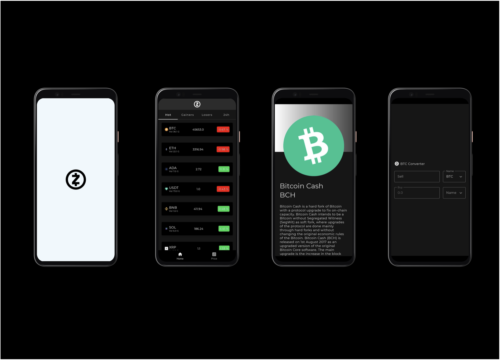

<h1 align="center">CoinBox</h1>

CoinBox is a small currency tracker app which is developed with Jetpack Compose. You can track coins with different categories.
Moreover you can check return value of bitcoin in different alt coin. It is possible to be informed with coins descriptions.

# Technologies
- Dagger Hilt
- Jetpack Compose
- Coroutines
- State Flow
- MVI
- Repository
- JUnit and Espresso test

NOTE: This read me was created by me for my motivation. It will be updated :)
